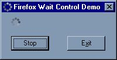

## Firefox Wait Control Clone

### Description

A control that mimics the wait control shown by Mozilla's Firefox web browser when navigating to a web object. Updated Nov 17, 2004 - added BackColor and IsPlaying properties.
 
### More Info
 

             |
---                |---
**Submitted On**   |2004-11-19 06:30:06
**By**             |[CubeSolver](https://github.com/Planet-Source-Code/PSCIndex/blob/master/ByAuthor/cubesolver.md)
**Level**          |Beginner
**User Rating**    |4.6 (51 globes from 11 users)
**Compatibility**  |VB 6\.0
**Category**       |[OLE/ COM/ DCOM/ Active\-X](https://github.com/Planet-Source-Code/PSCIndex/blob/master/ByCategory/ole-com-dcom-active-x__1-29.md)
**World**          |[Visual Basic](https://github.com/Planet-Source-Code/PSCIndex/blob/master/ByWorld/visual-basic.md)
**Archive File**   |[Firefox\_Wa18198411192004\.zip](https://github.com/Planet-Source-Code/cubesolver-firefox-wait-control-clone__1-57281/archive/master.zip)

